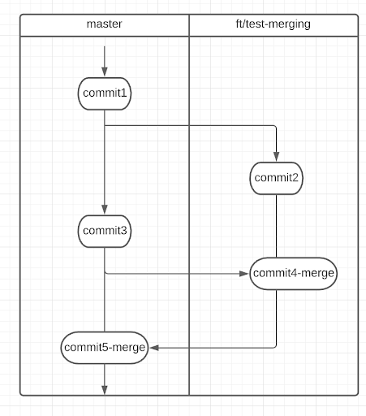

# Task
On your initiated repository - implement the branching and merging example provided below. Also - keep the commands which you used, we’ll discuss them together.

# Additional karma points:
- Git stash
- gitconfig
- Get familiar with cherry-pick
- Read about git hooks
- Merge Requests 

# Material:
- https://git-scm.com/book/en/v2/Git-Branching-Basic-Branching-and-Merging 
- https://www.atlassian.com/git/tutorials/using-branches/merge-strategy 
- https://blog.dnsimple.com/2019/01/two-years-of-squash-merge/ 
- https://www.tutorialspoint.com/git/index.htm 
- https://www.atlassian.com/git/tutorials/merging-vs-rebasing
